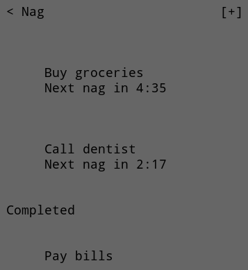

# Nag

An elegant, hyper-minimalistic iOS todo list app that persistently nags you with recurring reminders until tasks are completed.

## Features

- **Recurring Timers**: Each task has a customizable recurring timer (1 minute to 1 hour intervals)
- **Persistent Notifications**: Get nagged repeatedly until you complete your tasks
- **Minimalist Design**: Clean, elegant SwiftUI interface focused on what matters
- **Task Management**: Add, complete, and delete tasks with ease
- **Real-time Countdown**: See exactly when your next nag is coming
- **Completion Tracking**: Completed tasks are clearly separated from pending ones

## Screenshot

## How It Works

1. Add a task with a title and choose how often you want to be reminded
2. The app will send you notifications at your chosen interval
3. Notifications continue until you mark the task as complete
4. Tasks persist across app launches using UserDefaults

## Requirements

- iOS 16.0 or later
- Xcode 15.0 or later
- SwiftUI

## Building

Open `Nag.xcodeproj` in Xcode and run on a simulator or device.

## Privacy

All data is stored locally on your device. No data is sent to any servers.
